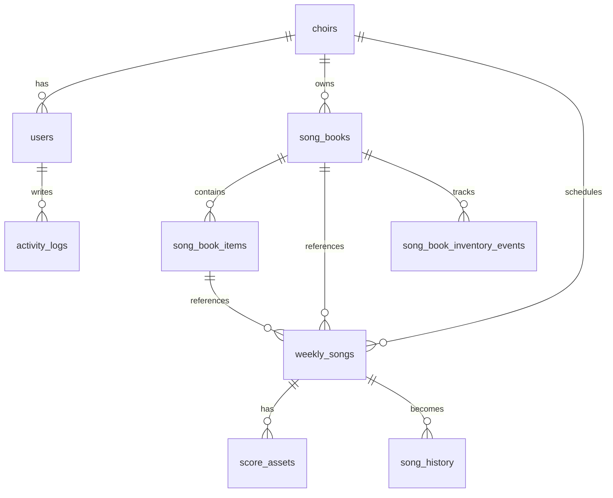

# Database Schema

이 문서는 현재 JSON 파일 기반 MVP를 DB 기반으로 옮길 때 사용할 1차 구조입니다.

목표는 단순합니다.

- 글로리아 찬양대의 주간곡을 한 번만 입력한다.
- 같은 주간곡에 합창 악보, 챔버 악보, 반주/참고 파일을 여러 개 붙인다.
- 미리듣기 링크와 자동 생성된 폴더 경로를 같은 주간곡에서 관리한다.
- 찬양집 4개 찬양대 소유 정보와 목차를 DB로 관리한다.
- 사용 이력, 재고 조정, 권한, 로그를 JSON이 아니라 테이블에 남긴다.

## 권장 시작점

처음에는 **SQLite**가 가장 현실적입니다.

- 서버 한 대에서 바로 사용 가능
- 파일 하나로 백업 가능
- 현재 Express 앱에 붙이기 쉬움
- 나중에 PostgreSQL로 이전하기 쉬운 구조

실제 스키마 파일은 [db/schema.sql](../db/schema.sql)에 있습니다.

## 핵심 구조



## 테이블 역할

### `choirs`

브니엘, 임마누엘, 할렐루야, 글로리아 찬양대를 저장합니다.

주간곡 운영은 글로리아 중심으로 쓰되, 찬양집 소유 구분은 네 찬양대 모두 저장할 수 있게 둡니다.

### `weekly_songs`

한 주에 부를 곡의 중심 테이블입니다.

현재 앱의 `scores` JSON 항목이 이 테이블로 이동합니다. 곡명, 날짜, 예배명, 미리듣기 링크, 찬양집, 페이지, 접근 권한, 자동 생성 폴더 경로를 이곳에 둡니다.

`folder_path` 예시:

```text
2026/2026-07-05_주하나님지으신모든세계
```

### `score_assets`

주간곡에 붙는 악보/파일 테이블입니다.

한 곡에 파일이 여러 개 붙을 수 있으므로 `weekly_songs`와 분리했습니다.

`asset_type` 값:

- `choir_score`: 합창 악보
- `chamber_score`: 챔버 편곡 악보
- `accompaniment`: 반주/MR
- `reference`: 참고 파일
- `other`: 기타

### `song_books`

찬양집 자체를 저장합니다.

현재 앱의 `books` JSON 항목이 이 테이블로 이동합니다. 보유 권수, 경고 기준, 보관 위치를 관리합니다.

### `song_book_items`

찬양집 목차입니다.

현재 `books.songs` 배열은 곡명만 들고 있어서 검색은 되지만 페이지, 작곡가, 편곡자 관리가 어렵습니다. DB에서는 목차를 별도 테이블로 분리해 나중에 “중앙성가 42집 128쪽”처럼 정확히 연결할 수 있게 했습니다.

### `song_history`

실제로 불렀던 기록입니다.

주간곡이 완료되면 `weekly_songs`에서 `song_history`로 기록을 남기는 방식이 좋습니다. 현재 앱의 `history` JSON 항목이 이 테이블로 이동합니다.

### `song_book_inventory_events`

찬양집 재고 변동 이력입니다.

단순히 현재 권수만 바꾸면 “언제 왜 줄었는지”가 사라지므로, +1/-1 조정도 이벤트로 남기도록 했습니다.

### `permission_rules`

현재 코드에 하드코딩된 `permissions` 객체를 DB로 옮기기 위한 테이블입니다.

역할은 현재 앱과 동일하게 `director`, `officer`, `member`, `guest`를 사용합니다.

### `activity_logs`

로그인, 곡 등록, 악보 다운로드, 권한 변경 같은 운영 로그입니다.

현재 앱의 `logs` JSON 항목이 이 테이블로 이동합니다.

## 현재 JSON에서 DB로 옮길 때 매핑

| 현재 위치 | DB 테이블 |
|---|---|
| `data/users.json` | `users` |
| `data/store.json.scores` | `weekly_songs`, `score_assets` |
| `data/store.json.books` | `song_books`, `song_book_items` |
| `data/store.json.history` | `song_history` |
| `data/store.json.logs` | `activity_logs` |
| `data/mail-outbox.json` | `mail_outbox` |

## 주간곡 등록 흐름

사용자가 곡 하나를 입력하면 서버는 아래 순서로 처리하면 됩니다.

1. `weekly_songs`에 곡을 생성한다.
2. 곡명과 날짜로 `folder_path`를 만든다.
3. 실제 서버 파일 시스템에 같은 폴더를 만든다.
4. 합창 악보를 올리면 `score_assets.asset_type = 'choir_score'`로 저장한다.
5. 챔버 악보를 올리면 `score_assets.asset_type = 'chamber_score'`로 저장한다.
6. 미리듣기 링크는 `weekly_songs.preview_url`에 저장한다.
7. 완료된 주간곡은 `song_history`에 복사하거나 연결한다.

## 다음 개발 단계

1. `better-sqlite3` 또는 `sqlite` 패키지를 추가한다.
2. 앱 시작 시 `db/schema.sql`을 실행해 DB를 초기화한다.
3. `readStore()` / `writeStore()`를 DB 조회/저장 함수로 교체한다.
4. 파일 업로드 경로를 `uploads/{folder_path}/...` 형태로 바꾼다.
5. 기존 JSON 데이터를 읽어 DB에 넣는 1회용 마이그레이션 스크립트를 만든다.
