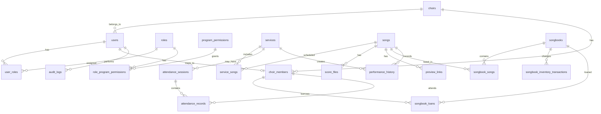

# 찬양대 악보 및 자산 관리 시스템 ERD 설계

작성일: 2026-07-03

## 설계 방향

이 시스템의 주 목적은 찬양대 악보 관리와 찬양대원 출석 관리이다. 추가로 찬양집/악보집 현황을 관리하고, 타 찬양대원에게는 제한된 범위의 찬양집 현황만 조회할 수 있도록 한다.

권한은 사용자에게 직접 기능을 붙이지 않고, **권한 그룹**에 **프로그램 권한**을 지정하는 방식으로 설계한다.

## 공통 감사 컬럼

대부분의 업무 테이블에는 아래 컬럼을 공통으로 둔다.

| 컬럼 | 타입 | 설명 |
|---|---|---|
| add_date | datetime | 최초 등록일시 |
| add_user_id | bigint FK NULL | 최초 등록 사용자 ID |
| mod_date | datetime NULL | 마지막 수정일시 |
| mod_user_id | bigint FK NULL | 마지막 수정 사용자 ID |

상세 변경 이력, 변경 전/후 데이터, IP, User-Agent까지 필요하면 별도 `audit_logs`에 남긴다.

업무 이벤트 자체의 날짜는 공통 컬럼과 별도로 유지한다.

예:

| 컬럼 | 의미 |
|---|---|
| uploaded_date | 악보 업로드 일시 |
| performed_at | 실제 찬양 일시 |
| loaned_at | 찬양집 대여 일시 |
| returned_at | 찬양집 반납 일시 |
| check_in_at | 출석 체크인 일시 |

## 핵심 ERD

## 1. 사용자/권한

### choirs

우리 찬양대와 타 찬양대를 모두 관리하는 테이블이다. 현재 시스템의 주 운영 대상은 우리 찬양대 1개지만, 타 찬양대원 계정도 발급할 수 있으므로 소속 구분을 둔다.

| 컬럼 | 타입 | 설명 |
|---|---|---|
| id | bigint PK | 찬양대 ID |
| name | varchar(100) | 찬양대명 |
| church_name | varchar(100) NULL | 교회명 |
| choir_type | varchar(20) | internal, external |
| contact_name | varchar(100) NULL | 대표 담당자명 |
| contact_phone | varchar(30) NULL | 대표 연락처 |
| memo | text | 비고 |
| add_date | datetime | 최초 등록일시 |
| add_user_id | bigint FK NULL | 최초 등록자 |
| mod_date | datetime NULL | 마지막 수정일시 |
| mod_user_id | bigint FK NULL | 마지막 수정자 |

### users

로그인 계정 테이블. 우리 찬양대원과 타 찬양대원 모두 이 테이블에 계정을 가진다.

| 컬럼 | 타입 | 설명 |
|---|---|---|
| id | bigint PK | 사용자 ID |
| choir_id | bigint FK NULL | 소속 찬양대 ID |
| email | varchar(255) UNIQUE | 로그인 이메일 |
| password_hash | varchar(255) | 비밀번호 해시 |
| name | varchar(100) | 이름 |
| phone | varchar(30) | 연락처 |
| user_type | varchar(20) | internal, external |
| status | varchar(20) | active, invited, suspended, deleted |
| last_login_at | datetime NULL | 마지막 로그인 |
| add_date | datetime | 최초 등록일시 |
| add_user_id | bigint FK NULL | 최초 등록자 |
| mod_date | datetime NULL | 마지막 수정일시 |
| mod_user_id | bigint FK NULL | 마지막 수정자 |

### roles

권한 그룹 테이블. 사용자를 일반대원, 임원, 타 찬양대원 같은 그룹으로 묶는다.

| 컬럼 | 타입 | 설명 |
|---|---|---|
| id | bigint PK | 권한 그룹 ID |
| code | varchar(50) UNIQUE | internal_member, officer, external_member |
| name | varchar(100) | 권한 그룹명 |
| description | text | 설명 |
| add_date | datetime | 최초 등록일시 |
| add_user_id | bigint FK NULL | 최초 등록자 |
| mod_date | datetime NULL | 마지막 수정일시 |
| mod_user_id | bigint FK NULL | 마지막 수정자 |

### user_roles

사용자와 권한 그룹의 매핑 테이블. 한 사용자가 여러 권한 그룹을 가질 수 있게 한다.

| 컬럼 | 타입 | 설명 |
|---|---|---|
| id | bigint PK | 사용자 권한 그룹 ID |
| user_id | bigint FK | 사용자 ID |
| role_id | bigint FK | 권한 그룹 ID |
| add_date | datetime | 권한 부여일시 |
| add_user_id | bigint FK NULL | 권한 부여자 |
| mod_date | datetime NULL | 마지막 수정일시 |
| mod_user_id | bigint FK NULL | 마지막 수정자 |

### program_permissions

프로그램 메뉴/기능 단위 권한 테이블. 화면 접근과 기능 사용 권한을 정의한다.

| 컬럼 | 타입 | 설명 |
|---|---|---|
| id | bigint PK | 프로그램 권한 ID |
| code | varchar(100) UNIQUE | scores.view, attendance.manage 등 |
| name | varchar(100) | 권한명 |
| module | varchar(50) | scores, attendance, members, songbooks 등 |
| action | varchar(30) | view, create, update, delete, manage |
| description | text | 설명 |
| is_active | boolean | 사용 여부 |
| add_date | datetime | 최초 등록일시 |
| add_user_id | bigint FK NULL | 최초 등록자 |
| mod_date | datetime NULL | 마지막 수정일시 |
| mod_user_id | bigint FK NULL | 마지막 수정자 |

### role_program_permissions

권한 그룹과 프로그램 권한의 매핑 테이블.

| 컬럼 | 타입 | 설명 |
|---|---|---|
| role_id | bigint FK | 권한 그룹 ID |
| program_permission_id | bigint FK | 프로그램 권한 ID |
| add_date | datetime | 최초 등록일시 |
| add_user_id | bigint FK NULL | 최초 등록자 |
| mod_date | datetime NULL | 마지막 수정일시 |
| mod_user_id | bigint FK NULL | 마지막 수정자 |

PK: `(role_id, program_permission_id)`

### 권한 그룹 예시

| 권한 그룹 | 설명 | 기본 접근 범위 |
|---|---|---|
| internal_member | 우리 찬양대 일반대원 | 악보 조회, 미리듣기, 출석 조회 |
| officer | 우리 찬양대 임원 | 악보 관리, 대원 명단 관리, 출석 관리, 찬양집 관리 |
| external_member | 타 찬양대원 | 공개된 찬양집 현황 조회 |

### 프로그램 권한 예시

| 권한 코드 | 설명 |
|---|---|
| scores.view | 악보 조회 |
| scores.manage | 악보 등록/수정/삭제 |
| preview_links.view | 미리듣기 링크 조회 |
| preview_links.manage | 미리듣기 링크 관리 |
| members.view | 찬양대원 명단 조회 |
| members.manage | 찬양대원 명단 관리 |
| attendance.view | 출석 현황 조회 |
| attendance.manage | 출석 등록/수정 |
| songbooks.view | 찬양집 현황 조회 |
| songbooks.view_public | 외부 공개 찬양집 현황 조회 |
| songbooks.manage | 찬양집/재고 관리 |
| audit_logs.view | 활동 로그 조회 |

## 2. 찬양대원 명단 관리

### choir_members

우리 찬양대원 명단의 중심 테이블이다. 로그인 계정과 연결하되, 필요하면 계정 없는 명단도 먼저 등록할 수 있도록 `user_id`는 nullable로 둔다.

| 컬럼 | 타입 | 설명 |
|---|---|---|
| id | bigint PK | 대원 ID |
| choir_id | bigint FK | 찬양대 ID |
| user_id | bigint FK NULL | 연결된 사용자 계정 |
| name | varchar(100) | 이름 |
| phone | varchar(30) | 연락처 |
| email | varchar(255) NULL | 이메일 |
| birth_date | date NULL | 생년월일 |
| gender | varchar(20) NULL | 성별 |
| voice_part | varchar(20) | soprano, alto, tenor, bass, conductor, accompanist |
| position | varchar(50) | 대장, 총무, 파트장, 대원 등 |
| join_date | date NULL | 입단일 |
| leave_date | date NULL | 퇴단일 |
| status | varchar(20) | active, inactive, leave, retired |
| emergency_contact | varchar(100) NULL | 비상 연락처 |
| memo | text | 비고 |
| add_date | datetime | 최초 등록일시 |
| add_user_id | bigint FK NULL | 최초 등록자 |
| mod_date | datetime NULL | 마지막 수정일시 |
| mod_user_id | bigint FK NULL | 마지막 수정자 |

추천 인덱스:

| 인덱스 | 컬럼 |
|---|---|
| idx_choir_members_status | choir_id, status |
| idx_choir_members_voice_part | choir_id, voice_part |
| uk_choir_member_user | choir_id, user_id |

### member_groups

파트, 조, 임원진 같은 그룹 관리 테이블이다.

| 컬럼 | 타입 | 설명 |
|---|---|---|
| id | bigint PK | 그룹 ID |
| choir_id | bigint FK | 찬양대 ID |
| name | varchar(100) | 그룹명 |
| group_type | varchar(30) | voice_part, team, officer, custom |
| description | text | 설명 |
| add_date | datetime | 최초 등록일시 |
| add_user_id | bigint FK NULL | 최초 등록자 |
| mod_date | datetime NULL | 마지막 수정일시 |
| mod_user_id | bigint FK NULL | 마지막 수정자 |

### member_group_members

대원과 그룹의 다대다 매핑 테이블이다.

| 컬럼 | 타입 | 설명 |
|---|---|---|
| group_id | bigint FK | 그룹 ID |
| member_id | bigint FK | 대원 ID |
| role_in_group | varchar(50) NULL | 파트장, 서기 등 |
| joined_at | date NULL | 그룹 참여일 |
| left_at | date NULL | 그룹 종료일 |
| add_date | datetime | 최초 등록일시 |
| add_user_id | bigint FK NULL | 최초 등록자 |
| mod_date | datetime NULL | 마지막 수정일시 |
| mod_user_id | bigint FK NULL | 마지막 수정자 |

PK: `(group_id, member_id)`

## 3. 예배/일정/찬양곡 관리

### services

주일예배, 수요예배, 특별찬양 등 예배/행사 단위 테이블이다.

| 컬럼 | 타입 | 설명 |
|---|---|---|
| id | bigint PK | 예배/행사 ID |
| service_date | date | 날짜 |
| start_time | time NULL | 시작 시간 |
| service_type | varchar(50) | 주일 1부, 주일 2부, 수요예배 등 |
| title | varchar(150) | 예배/행사명 |
| location | varchar(100) NULL | 장소 |
| status | varchar(20) | planned, done, canceled |
| memo | text | 메모 |
| add_date | datetime | 최초 등록일시 |
| add_user_id | bigint FK NULL | 최초 등록자 |
| mod_date | datetime NULL | 마지막 수정일시 |
| mod_user_id | bigint FK NULL | 마지막 수정자 |

### songs

곡 마스터 테이블. 동일한 곡을 여러 예배, 악보, 찬양집에서 재사용한다.

| 컬럼 | 타입 | 설명 |
|---|---|---|
| id | bigint PK | 곡 ID |
| title | varchar(200) | 곡명 |
| subtitle | varchar(200) NULL | 부제 |
| composer | varchar(100) NULL | 작곡가 |
| lyricist | varchar(100) NULL | 작사가 |
| arranger | varchar(100) NULL | 편곡자 |
| genre | varchar(50) NULL | 장르 |
| language | varchar(30) NULL | 언어 |
| default_key | varchar(20) NULL | 기본 조성 |
| tags | varchar(500) NULL | 검색 태그 |
| memo | text | 메모 |
| add_date | datetime | 최초 등록일시 |
| add_user_id | bigint FK NULL | 최초 등록자 |
| mod_date | datetime NULL | 마지막 수정일시 |
| mod_user_id | bigint FK NULL | 마지막 수정자 |

### service_songs

예배 일정에 어떤 곡이 배치되는지 관리한다.

| 컬럼 | 타입 | 설명 |
|---|---|---|
| id | bigint PK | 예배곡 ID |
| service_id | bigint FK | 예배/행사 ID |
| song_id | bigint FK | 곡 ID |
| order_no | int | 순서 |
| usage_type | varchar(50) | 입례, 봉헌, 찬양대, 폐회, 연습곡 등 |
| planned_key | varchar(20) NULL | 해당 예배 조성 |
| note | text | 특이사항 |
| add_date | datetime | 최초 등록일시 |
| add_user_id | bigint FK NULL | 최초 등록자 |
| mod_date | datetime NULL | 마지막 수정일시 |
| mod_user_id | bigint FK NULL | 마지막 수정자 |

추천 유니크:

| 제약 | 컬럼 |
|---|---|
| uk_service_songs_order | service_id, order_no |

## 4. 악보 파일/미리듣기 링크

### score_files

악보 파일 버전 관리 테이블이다.

| 컬럼 | 타입 | 설명 |
|---|---|---|
| id | bigint PK | 악보 파일 ID |
| song_id | bigint FK | 곡 ID |
| file_name | varchar(255) | 원본 파일명 |
| file_path | varchar(500) | 저장 경로 |
| file_type | varchar(30) | pdf, jpg, png 등 |
| file_size | bigint | 파일 크기 |
| version_no | int | 버전 번호 |
| version_label | varchar(50) | v1.0, 2026-07-03 수정본 등 |
| voice_part | varchar(20) NULL | 특정 파트용 악보 |
| access_level | varchar(20) | all, members, officers, private |
| is_latest | boolean | 최신 버전 여부 |
| uploaded_date | datetime | 업로드 일시 |
| change_note | text | 변경 내용 |
| add_date | datetime | 최초 등록일시 |
| add_user_id | bigint FK NULL | 최초 등록자 |
| mod_date | datetime NULL | 마지막 수정일시 |
| mod_user_id | bigint FK NULL | 마지막 수정자 |

### preview_links

YouTube, SoundCloud, Vimeo 등 미리듣기/연습 링크 테이블이다.

| 컬럼 | 타입 | 설명 |
|---|---|---|
| id | bigint PK | 링크 ID |
| song_id | bigint FK | 곡 ID |
| provider | varchar(50) | youtube, soundcloud, vimeo, other |
| title | varchar(200) | 링크 제목 |
| url | varchar(1000) | URL |
| media_type | varchar(30) | audio, video |
| voice_part | varchar(20) NULL | 파트 연습 링크 |
| sort_order | int | 표시 순서 |
| add_date | datetime | 최초 등록일시 |
| add_user_id | bigint FK NULL | 최초 등록자 |
| mod_date | datetime NULL | 마지막 수정일시 |
| mod_user_id | bigint FK NULL | 마지막 수정자 |

## 5. 찬양집/자산/재고 관리

### songbooks

찬양집 또는 악보집 자산 테이블이다. 타 찬양대원에게 공개할 현황은 `external_visible`로 제어한다.

| 컬럼 | 타입 | 설명 |
|---|---|---|
| id | bigint PK | 찬양집 ID |
| title | varchar(200) | 찬양집명 |
| publisher | varchar(100) NULL | 출판사 |
| edition | varchar(50) NULL | 판/버전 |
| total_quantity | int | 총 보유 수량 |
| available_quantity | int | 사용 가능 수량 |
| loaned_quantity | int | 대여 중 수량 |
| damaged_quantity | int | 훼손 수량 |
| lost_quantity | int | 분실 수량 |
| reorder_threshold | int | 재고 알림 기준 |
| location | varchar(100) NULL | 보관 위치 |
| external_visible | boolean | 타 찬양대 공개 여부 |
| external_note | text NULL | 외부 공개용 비고 |
| memo | text | 내부 메모 |
| add_date | datetime | 최초 등록일시 |
| add_user_id | bigint FK NULL | 최초 등록자 |
| mod_date | datetime NULL | 마지막 수정일시 |
| mod_user_id | bigint FK NULL | 마지막 수정자 |

### songbook_songs

찬양집에 수록된 곡 목록 테이블이다.

| 컬럼 | 타입 | 설명 |
|---|---|---|
| id | bigint PK | 수록곡 ID |
| songbook_id | bigint FK | 찬양집 ID |
| song_id | bigint FK NULL | 곡 마스터 ID |
| title | varchar(200) | 수록곡명 |
| page_no | varchar(30) NULL | 페이지 |
| song_number | varchar(30) NULL | 곡 번호 |
| composer | varchar(100) NULL | 작곡가 |
| genre | varchar(50) NULL | 장르 |
| memo | text | 메모 |
| add_date | datetime | 최초 등록일시 |
| add_user_id | bigint FK NULL | 최초 등록자 |
| mod_date | datetime NULL | 마지막 수정일시 |
| mod_user_id | bigint FK NULL | 마지막 수정자 |

### songbook_inventory_transactions

찬양집 재고 증감 이력 테이블이다.

| 컬럼 | 타입 | 설명 |
|---|---|---|
| id | bigint PK | 재고 이력 ID |
| songbook_id | bigint FK | 찬양집 ID |
| transaction_type | varchar(30) | purchase, loan, return, damage, loss, adjust |
| quantity | int | 증감 수량 |
| before_quantity | int | 변경 전 수량 |
| after_quantity | int | 변경 후 수량 |
| reason | text | 사유 |
| add_date | datetime | 처리 일시 |
| add_user_id | bigint FK NULL | 처리자 |
| mod_date | datetime NULL | 마지막 수정일시 |
| mod_user_id | bigint FK NULL | 마지막 수정자 |

### songbook_loans

대원별 찬양집 대여/반납 관리 테이블이다.

| 컬럼 | 타입 | 설명 |
|---|---|---|
| id | bigint PK | 대여 ID |
| songbook_id | bigint FK | 찬양집 ID |
| member_id | bigint FK | 대원 ID |
| quantity | int | 대여 수량 |
| loaned_at | datetime | 대여일시 |
| due_date | date NULL | 반납 예정일 |
| returned_at | datetime NULL | 반납일시 |
| status | varchar(20) | loaned, returned, overdue, lost |
| memo | text | 메모 |
| add_date | datetime | 최초 등록일시 |
| add_user_id | bigint FK NULL | 최초 등록자 |
| mod_date | datetime NULL | 마지막 수정일시 |
| mod_user_id | bigint FK NULL | 마지막 수정자 |

## 6. 출석 관리

### attendance_sessions

출석 체크 단위 테이블. 예배, 연습, 행사 모두 처리할 수 있다.

| 컬럼 | 타입 | 설명 |
|---|---|---|
| id | bigint PK | 출석 세션 ID |
| service_id | bigint FK NULL | 연결된 예배/행사 |
| session_date | date | 출석일 |
| start_time | time NULL | 시작 시간 |
| end_time | time NULL | 종료 시간 |
| session_type | varchar(30) | worship, rehearsal, event, meeting |
| title | varchar(150) | 세션명 |
| location | varchar(100) NULL | 장소 |
| status | varchar(20) | open, closed, canceled |
| add_date | datetime | 최초 등록일시 |
| add_user_id | bigint FK NULL | 최초 등록자 |
| mod_date | datetime NULL | 마지막 수정일시 |
| mod_user_id | bigint FK NULL | 마지막 수정자 |

### attendance_records

대원별 출석 결과 테이블.

| 컬럼 | 타입 | 설명 |
|---|---|---|
| id | bigint PK | 출석 기록 ID |
| session_id | bigint FK | 출석 세션 ID |
| member_id | bigint FK | 대원 ID |
| status | varchar(20) | present, late, absent, excused, online |
| check_in_at | datetime NULL | 체크인 시간 |
| check_out_at | datetime NULL | 체크아웃 시간 |
| late_minutes | int DEFAULT 0 | 지각 시간 |
| reason | varchar(255) NULL | 결석/지각 사유 |
| note | text | 비고 |
| add_date | datetime | 최초 등록일시 |
| add_user_id | bigint FK NULL | 최초 등록자 |
| mod_date | datetime NULL | 마지막 수정일시 |
| mod_user_id | bigint FK NULL | 마지막 수정자 |

추천 유니크:

| 제약 | 컬럼 |
|---|---|
| uk_attendance_member_session | session_id, member_id |

### attendance_templates

정기 예배/연습 출석 세션 자동 생성을 위한 템플릿 테이블이다.

| 컬럼 | 타입 | 설명 |
|---|---|---|
| id | bigint PK | 템플릿 ID |
| name | varchar(100) | 템플릿명 |
| session_type | varchar(30) | worship, rehearsal 등 |
| day_of_week | int | 0=일요일, 1=월요일 |
| start_time | time | 시작 시간 |
| default_location | varchar(100) NULL | 기본 장소 |
| is_active | boolean | 사용 여부 |
| add_date | datetime | 최초 등록일시 |
| add_user_id | bigint FK NULL | 최초 등록자 |
| mod_date | datetime NULL | 마지막 수정일시 |
| mod_user_id | bigint FK NULL | 마지막 수정자 |

## 7. 찬양 이력 관리

### performance_history

실제 찬양한 기록 테이블. 예배곡에서 자동 생성하거나 수동 등록할 수 있다.

| 컬럼 | 타입 | 설명 |
|---|---|---|
| id | bigint PK | 찬양 이력 ID |
| service_id | bigint FK NULL | 예배/행사 ID |
| service_song_id | bigint FK NULL | 예배곡 ID |
| song_id | bigint FK | 곡 ID |
| performed_at | datetime | 찬양 일시 |
| service_type | varchar(50) | 예배 종류 스냅샷 |
| media_url | varchar(1000) NULL | 녹음/영상 링크 |
| note | text | 메모 |
| add_date | datetime | 최초 등록일시 |
| add_user_id | bigint FK NULL | 최초 등록자 |
| mod_date | datetime NULL | 마지막 수정일시 |
| mod_user_id | bigint FK NULL | 마지막 수정자 |

추천 인덱스:

| 인덱스 | 컬럼 |
|---|---|
| idx_performance_song_date | song_id, performed_at |

## 8. 알림/활동 로그

### notifications

악보 등록, 재고 부족, 출석 미체크 등 알림 테이블이다.

| 컬럼 | 타입 | 설명 |
|---|---|---|
| id | bigint PK | 알림 ID |
| user_id | bigint FK | 수신자 |
| type | varchar(50) | score_uploaded, low_stock, attendance_missing 등 |
| title | varchar(200) | 제목 |
| message | text | 내용 |
| link_url | varchar(500) NULL | 연결 화면 |
| read_at | datetime NULL | 읽은 시간 |
| add_date | datetime | 최초 등록일시 |
| add_user_id | bigint FK NULL | 최초 등록자 |
| mod_date | datetime NULL | 마지막 수정일시 |
| mod_user_id | bigint FK NULL | 마지막 수정자 |

### audit_logs

권한 변경, 악보 업로드, 재고 수정, 출석 수정 등 주요 작업 로그 테이블이다.

| 컬럼 | 타입 | 설명 |
|---|---|---|
| id | bigint PK | 로그 ID |
| actor_user_id | bigint FK NULL | 작업자 |
| action | varchar(100) | scores.manage, attendance.update 등 |
| target_type | varchar(50) | songs, score_files, attendance_records 등 |
| target_id | bigint NULL | 대상 ID |
| before_data | json NULL | 변경 전 데이터 |
| after_data | json NULL | 변경 후 데이터 |
| ip_address | varchar(45) NULL | IP |
| user_agent | varchar(500) NULL | User-Agent |
| add_date | datetime | 로그 생성일시 |

## 구현 우선순위

### 1차 MVP

| 영역 | 테이블 |
|---|---|
| 사용자/권한 | users, roles, user_roles, program_permissions, role_program_permissions |
| 대원 명단 | choirs, choir_members |
| 악보 관리 | services, songs, service_songs, score_files, preview_links |
| 출석 관리 | attendance_sessions, attendance_records |
| 찬양집 현황 | songbooks, songbook_songs |
| 로그 | audit_logs |

### 2차 확장

| 영역 | 테이블 |
|---|---|
| 그룹 관리 | member_groups, member_group_members |
| 재고/대여 이력 | songbook_inventory_transactions, songbook_loans |
| 찬양 이력 분석 | performance_history |
| 알림/자동화 | notifications, attendance_templates |

## 상태값 권장안

### users.user_type

| 값 | 의미 |
|---|---|
| internal | 우리 찬양대 사용자 |
| external | 타 찬양대 사용자 |

### choir_members.status

| 값 | 의미 |
|---|---|
| active | 활동 중 |
| inactive | 비활동 |
| leave | 휴식/휴직 |
| retired | 퇴단 |

### attendance_records.status

| 값 | 의미 |
|---|---|
| present | 출석 |
| late | 지각 |
| absent | 결석 |
| excused | 사유 결석 |
| online | 온라인 참석 |

### services.status

| 값 | 의미 |
|---|---|
| planned | 예정 |
| done | 완료 |
| canceled | 취소 |

### score_files.access_level

| 값 | 의미 |
|---|---|
| all | 전체 공개 |
| members | 우리 찬양대원 공개 |
| officers | 임원 공개 |
| private | 관리자 전용 |
